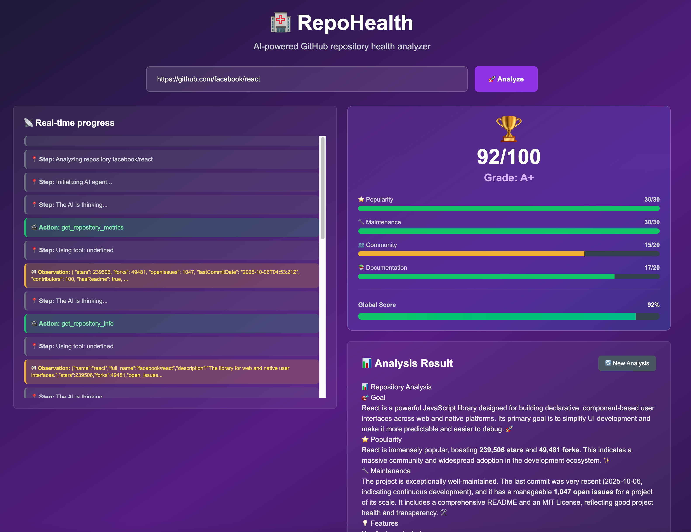
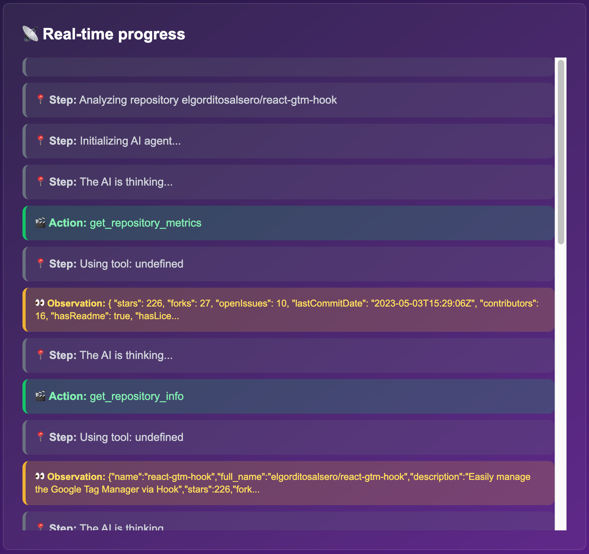
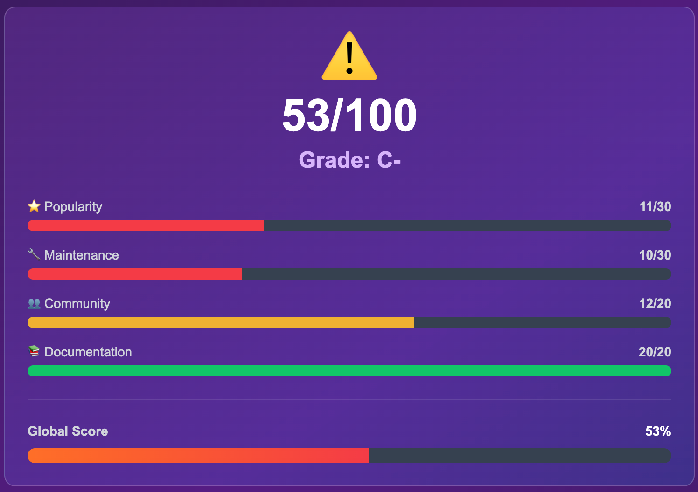

# 🔍 Repo## ✨ Features

- 🤖 **ReAct AI Agent**: Uses the ReAct pattern (Reasoning + Acting) to methodically analyze repositories
- 📊 **Complete Analysis**: Popularity, active maintenance, contributors, project health
- 🛠️ **4 GitHub Tools**: Direct access to GitHub API through custom tools
- 🎨 **Modern Interface**: Responsive UI with Tailwind CSS and dark mode
- 📈 **Health Score**: Repository health score (0-100) with detailed breakdown
- 💬 **Real-Time Streaming**: Live visualization of the agent's thinking process
- ⚡ **Next.js 14**: App Router, TypeScript, and modern optimizations

## 📸 Screenshots

### Main Interface

*Clean and modern interface with real-time analysis progress*

### Real-Time Agent Thinking

*Watch the AI agent's reasoning process in real-time with the ReAct pattern*

### Health Score Analysis

*Comprehensive health score with detailed breakdown across multiple metrics*

### Complete Analysis Results

*Detailed insights including popularity, maintenance, community, and recommendations*

> **Note**: To add your own screenshots, create a `screenshots` folder in the project root and add your images there.

## 🎯 Overview

The AI agent automatically analyzes:
- ⭐ Popularity (stars, forks)
- 🔧 Maintenance (recent activity, latest commits)
- 👥 Community (contributors, diversity)
- 📚 Documentation (README, license)

## 🚀 Quick Start (2 minutes)t GitHub Repository Analyzer

# 🏥 RepoHealth - AI-Powered GitHub Repository Health Analyzer

An intelligent web application that uses AI agents (LangChain.js + Gemini) to automatically analyze GitHub repositories and provide detailed health insights in real-time.

[](https://nextjs.org/)
[](https://www.typescriptlang.org/)
[](https://js.langchain.com/)
[](./LICENSE)

## ✨ Features

- 🤖 **ReAct AI Agent**: Uses the ReAct pattern (Reasoning + Acting) to methodically analyze repositories
- 📊 **Complete Analysis**: Popularity, active maintenance, contributors, project health
- 🛠️ **4 GitHub Tools**: Direct access to GitHub API through custom tools
- 🎨 **Modern Interface**: Responsive UI with Tailwind CSS and dark mode
- 📈 **Health Score**: Repository health score (0-100) with detailed breakdown
- �� **Real-Time Streaming**: Live visualization of the agent's thinking process
- ⚡ **Next.js 14**: App Router, TypeScript, and modern optimizations

## 📸 Overview

The AI agent automatically analyzes:
- ⭐ Popularity (stars, forks)
- 🔧 Maintenance (recent activity, latest commits)
- 👥 Community (contributors, diversity)
- 📚 Documentation (README, license)

## 🚀 Quick Start (2 minutes)

### Prerequisites

- Node.js 18+ ([Download](https://nodejs.org/))
- npm (included with Node.js)
- Gemini API Key ([Free](https://makersuite.google.com/app/apikey))
- GitHub Token ([Optional](https://github.com/settings/tokens))

### Express Installation

\`\`\`bash
```bash
# 1. Clone the repository
git clone https://github.com/your-username/repohealth.git
cd repohealth

# 2. Install dependencies
npm install

# 3. Configure API keys
cp .env.local.template .env.local
# Edit .env.local and add your Gemini key

# 4. Launch the application
npm run dev

# 5. Open http://localhost:3000
\`\`\`

### API Keys Configuration

Create a \`.env.local\` file at the project root:

\`\`\`env
# REQUIRED - Get it for free at https://makersuite.google.com/app/apikey
GEMINI_API_KEY=your_gemini_api_key

# OPTIONAL - Increases limit from 60 to 5000 requests/hour
# Create at https://github.com/settings/tokens (scope: public_repo)
GITHUB_TOKEN=your_github_token
\`\`\`

### Installation Verification

To verify everything is working:

\`\`\`bash
# Test configuration
./test-project.sh

# If OK, start the server
npm run dev
\`\`\`

## 🎯 Usage

### Simple Interface

1. **Enter the URL** of a GitHub repository in the input field
   \`\`\`
   https://github.com/owner/repository
   \`\`\`

2. **Click "🚀 Analyze"** or use the example buttons

3. **Watch the agent work** in real-time:
   - 💭 **Thoughts**: Agent's reasoning process
   - 🎬 **Actions**: Tools being called (get_repository_info, etc.)
   - 👀 **Observations**: Tool results
   - 📍 **Steps**: Analysis progress

4. **Receive complete analysis** with:
   - 📊 Health Score (0-100) with breakdown
   - ⭐ Popularity and adoption
   - 🔧 Maintenance status
   - 👥 Community activity
   - 📚 Documentation quality
   - 💡 Recommendations

### Example Repositories to Test

| URL | Description |
|-----|-------------|
| \`https://github.com/langchain-ai/langchainjs\` | 🤖 Modern AI framework |
| \`https://github.com/vercel/next.js\` | ⚡ Popular React framework |
| \`https://github.com/facebook/react\` | ⚛️ Reference UI library |
| \`https://github.com/microsoft/vscode\` | 💻 Open source code editor |

## 🏗️ Architecture

### Tech Stack

| Category | Technology | Usage |
|----------|------------|-------|
| **Framework** | Next.js 14 | App Router, SSR, API Routes |
| **Language** | TypeScript | Type safety, autocomplete |
| **AI** | LangChain.js + Gemini 2.0 Flash | ReAct agent, custom tools |
| **API** | Octokit | GitHub REST API v3 |
| **Styling** | Tailwind CSS | Modern and responsive design |
| **Validation** | Zod | Tool schema validation |

### Project Structure

\`\`\`
repohealth/
├── 🎨 INTERFACE (app/)
│   ├── page.tsx                    # Main page with form
│   ├── layout.tsx                  # Layout with SEO metadata
│   ├── globals.css                 # Global Tailwind styles
│   ├── components/
│   │   └── HealthScore.tsx         # Health Score component
│   └── api/
│       └── analyze/
│           └── route.ts            # API endpoint with streaming
│
├── 🤖 AI LOGIC (lib/)
│   ├── agent.ts                    # LangChain Agent + Gemini
│   ├── github-tools.ts             # 4 custom GitHub tools
│   ├── health-score.ts             # Health score calculation
│   └── utils.ts                    # Utility functions
│
├── 🎣 HOOKS (hooks/)
│   └── useStreamingAnalysis.ts     # React hook for streaming
│
├── 📝 TYPES (types/)
│   └── index.ts                    # TypeScript definitions
│
├── ⚙️ CONFIGURATION
│   ├── package.json                # 455+ dependencies
│   ├── tsconfig.json               # Strict TypeScript config
│   ├── tailwind.config.ts          # Custom Tailwind config
│   ├── next.config.js              # Optimized Next.js config
│   ├── .eslintrc.json              # Linting rules
│   └── .env.local.template         # Environment variables template
│
└── 📚 DOCUMENTATION
    ├── README.md                   # This file
    └── LICENSE                     # MIT License
\`\`\`

### The 4 AI Agent Tools

The agent has a complete "toolbox":

#### 1. **\`get_repository_info\`** - Repository Metadata
\`\`\`typescript
// Retrieves essential information
{
  name: string,
  stars: number,              // ⭐ Popularity
  forks: number,              // �� Engagement
  open_issues: number,        // 🐛 Open issues
  language: string,           // 💻 Main language
  created_at: string,         // 📅 Creation date
  updated_at: string,         // 🔄 Last update
  topics: string[],           // 🏷️ Project tags
  license: string,            // 📜 License
}
\`\`\`

#### 2. **\`get_readme_content\`** - README Content
\`\`\`typescript
// Extracts and decodes README.md
// - Automatically decoded from base64
// - Truncated to 3000 characters if too long
// - Best source for understanding the project
\`\`\`

#### 3. **\`get_recent_activity\`** - Recent Activity
\`\`\`typescript
// Checks for active maintenance
{
  last_commit_date: string,      // 📅 Last commit date
  last_commit_message: string,   // 💬 Commit message
  last_commit_author: string,    // 👤 Author
  recent_commits: CommitInfo[]   // 📊 Last 5 commits
}
\`\`\`

#### 4. **\`get_top_contributors\`** - Top Contributors
\`\`\`typescript
// Lists main contributors
{
  total_contributors: number,     // 👥 Total count
  top_contributors: [             // 🏆 Top 10
    {
      username: string,
      contributions: number
    }
  ]
}
\`\`\`

### The ReAct Pattern in Action

The agent follows a **Thought → Action → Observation** cycle:

\`\`\`
┌─────────────────────────────────────────────────┐
│ 1. 💭 THOUGHT                                    │
│    "I need to analyze the repo's popularity"   │
└─────────────────────────────────────────────────┘
                      ↓
┌─────────────────────────────────────────────────┐
│ 2. 🎬 ACTION                                     │
│    Calls: get_repository_info(owner, repo)     │
└─────────────────────────────────────────────────┘
                      ↓
┌─────────────────────────────────────────────────┐
│ 3. 👀 OBSERVATION                                │
│    Receives: { stars: 10500, forks: 2000, ... }│
└─────────────────────────────────────────────────┘
                      ↓
┌─────────────────────────────────────────────────┐
│ 4. 💭 THOUGHT                                    │
│    "10500 stars = very popular!                 │
│     Let's check maintenance now..."             │
└─────────────────────────────────────────────────┘
                      ↓
┌─────────────────────────────────────────────────┐
│ 5. 🎬 ACTION                                     │
│    Calls: get_recent_activity(owner, repo)     │
└─────────────────────────────────────────────────┘
                      ↓
┌─────────────────────────────────────────────────┐
│ 6. 👀 OBSERVATION                                │
│    Receives: { last_commit_date: "2025-10-05" }│
└─────────────────────────────────────────────────┘
                      ↓
┌─────────────────────────────────────────────────┐
│ 7. ✅ FINAL ANSWER                               │
│    Generates complete structured analysis       │
│    with Health Score and recommendations        │
└─────────────────────────────────────────────────┘
\`\`\`

This cycle is **visible in real-time** in the interface thanks to streaming!

## 🛠️ Development

### Available Scripts

\`\`\`bash
# Development
npm run dev          # Start development server (port 3000)
npm run build        # Create optimized production build
npm run start        # Start production server
npm run lint         # Check code with ESLint

# Tests and Debugging
./test-project.sh    # Configuration test script
./init-git.sh        # Git initialization script
\`\`\`

## 🤝 Contributing

Contributions are welcome! Feel free to:

1. Fork the project
2. Create a branch (\`git checkout -b feature/AmazingFeature\`)
3. Commit your changes (\`git commit -m 'Add some AmazingFeature'\`)
4. Push to the branch (\`git push origin feature/AmazingFeature\`)
5. Open a Pull Request

## 📄 License

This project is licensed under the MIT License. See the [LICENSE](./LICENSE) file for more details.

## 🙏 Acknowledgments

- [LangChain.js](https://github.com/langchain-ai/langchainjs) - Powerful framework for AI agents
- [Google Gemini](https://deepmind.google/technologies/gemini/) - Performant and free language model
- [Octokit](https://github.com/octokit/octokit.js) - Official GitHub API client
- [Next.js](https://nextjs.org/) - The best React framework
- [Tailwind CSS](https://tailwindcss.com/) - Modern utility-first CSS
- The open source community 💙

---

<div align="center">

**Made with 💜 by the community**

[⭐ Star this project](../../stargazers) • [🐛 Report a bug](../../issues) • [💡 Suggest a feature](../../issues/new)

</div>

---

**Last updated**: October 2025 | **Version**: 1.0.0
